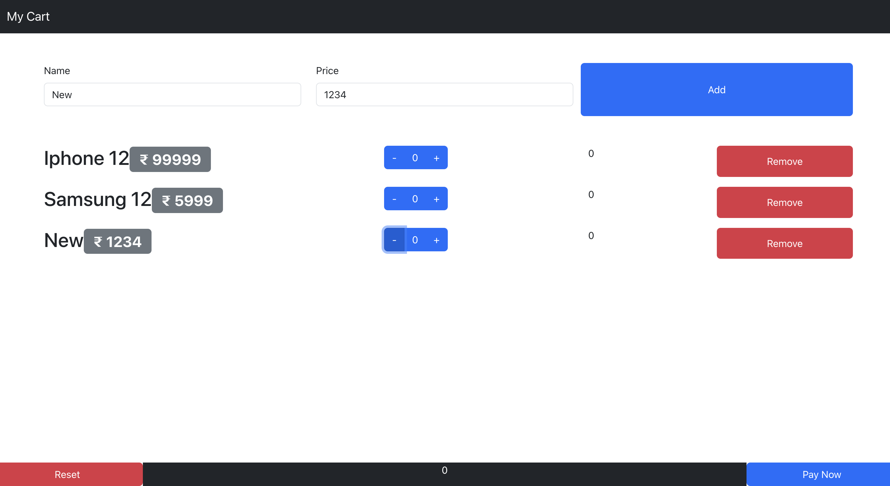

# React Cart App

This is a React app that implements a shopping cart functionality. Users can add or remove products from the cart, increment or decrement product quantities, view the total price in the footer, reset the cart, and add new products with names and prices.



## Demo

Check out the live demo of the React Cart app [here](https://react-cart-tau-flame.vercel.app).

## Features

- Add products to the cart
- Increment or decrement product quantities
- Display total price in the footer
- Reset the cart
- Add new products with names and prices

## Installation

1. Clone the repository:

   ```bash
   git clone https://github.com/your-username/react-cart-app.git
   ```

2. Navigate to the project directory:

   ```bash
   cd react-cart-app
   ```

3. Install dependencies:

   ```bash
   npm install
   ```

4. Start the development server:

   ```bash
   npm start
   ```

5. Open your web browser and visit `http://localhost:3000` to access the app.

## Usage

1. Browse the available products.
2. Use the "+" and "-" buttons to adjust the quantity of a product in the cart.
3. The total price will be automatically updated in the footer.
4. Click the "Reset" button to clear the cart.
5. To add new products, click the "Add New Product" button and enter the name and price.

## Contributing

Contributions to the React Cart app are welcome! If you find any issues or have suggestions for improvements, please feel free to submit a pull request or open an issue in the [issue tracker](https://github.com/your-username/react-cart-app/issues).

When contributing to this project, please follow the [code of conduct](CODE_OF_CONDUCT.md).

## License

This project is licensed under the [MIT License](LICENSE).

## Acknowledgements

- [React](https://reactjs.org) - JavaScript library for building user interfaces.
